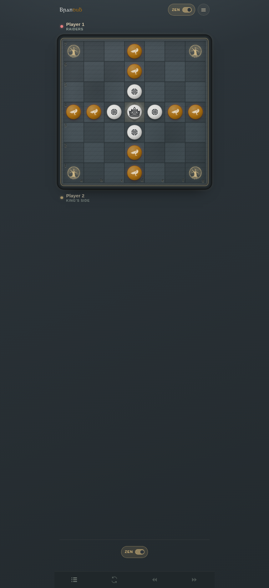

# Brandubh · Irish Hnefatafl

A slick, fully playable browser version of **Brandubh** — the Irish 7×7 form of
hnefatafl, the asymmetric Norse–Gaelic “king’s table” war game. Play the King’s
desperate escape or the raiders’ hunt, against a friend (over the board) or a
built-in AI, with two historical rule variants and a custom rule editor.



- ⚔️ Correct, tested tafl engine (custodial capture, hostile corners & throne, strong-king throne capture)
- 🤖 Iterative-deepening alpha–beta AI (transposition table + quiescence search) that runs in a Web Worker, so hard-level thinking never freezes the board — across four difficulty levels, up to **Ollamh** and its opening book
- 👑 Two rule variants: **World Tafl Federation** and **Walker** — plus a custom rule editor
- 🌐 Localised in English and Spanish
- ⏱️ Optional Lichess-style chess clock (**off by default** — no timer) — a time bank plus per-move Fischer increment (**3+2** when enabled), bullet → rapid presets and a custom control, with flag-on-time
- 🧘 **Zen mode** — a calm, over-the-board layout showing only the board, whose turn it is, the clock and the move log; game controls are contextual (a minimal "Next game" / "Next set" prompt appears only when a game ends), and every other panel (scoreboard, captured tray, move nav, rules, takeback, resign, pause, settings) is an opt-in extra you can reveal from settings
- 📱 Mobile-first, no backend, works offline — pure static SPA
- 🎨 Carved-wood board, crown / shield / axe piece emblems, move log, undo

## Quick start

```bash
npm install
npm run dev       # http://localhost:5173
npm run build     # static bundle in ./dist  (deploy to Vercel / Netlify / GH Pages)
npm run preview   # preview the production build
npx tsx scripts/selftest.ts   # headless engine sanity checks
```

The build is a self-contained static site (`base: "./"`), so `dist/` can be
dropped onto any static host.

---

## The rules of Brandubh

Brandubh (*“black raven”*, also spelt **brandub / brannumh**) is the Irish
variant of hnefatafl, played on a **7×7** board with just **thirteen pieces**.
Like most hnefatafl games its medieval rules were never written down — they
survive only in poetry, legend, and a scatter of archaeological board finds — so
what follows is the widely-used modern reconstruction (the version played
competitively on Aage Nielsen’s hnefatafl site and by the World Tafl Federation).

### The board and armies

```
   a  b  c  d  e  f  g
7  ◉  .  .  A  .  .  ◉      A = attacker (raider)   × 8
6  .  .  .  A  .  .  .      D = defender (warrior)  × 4
5  .  .  .  D  .  .  .      K = king                × 1
4  A  A  D  K  D  A  A      ◉ = corner (restricted + hostile)
3  .  .  .  D  .  .  .      ⊕ = throne (centre, restricted)
2  .  .  .  A  .  .  .
1  ◉  .  .  A  .  .  ◉
```

- **The King’s side** — the King on the central **throne**, ringed by **4
  defenders**. Outnumbered two-to-one.
- **The attackers** — **8 raiders** massed at the middle of each edge, forming a
  cross with the defenders.
- The **attackers move first**. Turns then alternate.

### Movement

- Every piece moves like a **rook in chess**: any number of empty squares
  orthogonally (up, down, left, right). **No diagonals, no jumping.**
- Only the **King** may stop on the **throne** or a **corner**. Ordinary
  soldiers may pass *over* the empty throne but may never rest on it, and may
  never enter a corner.
- In both reconstructions the King may return to the throne after leaving it.

### Capturing

- You capture an enemy **soldier** by **flanking** it: move a piece so the enemy
  is trapped between two of your own pieces along a rank or file. The trapped
  piece is removed immediately.
- **You must move into the trap.** A piece that *moves between* two enemies of
  its own accord is **safe** — captures only happen on the capturing player’s
  move.
- The **four corners** and the **empty throne** are **hostile squares**: they
  count as “your piece” for the purpose of completing a capture, for both sides.
- A single move can capture several pieces at once (one in each direction).

### Winning

| Side | Wins by |
|------|---------|
| 👑 **King’s side (defenders)** | Getting the **King to any corner**. |
| ⚔️ **Attackers (raiders)** | **Capturing the King**. |

- The King is captured by being surrounded **on two opposite sides** in the open
  (a raider, a hostile corner, or the board edge does **not** help here — the
  king needs actual flanking).
- **Strong king by the throne:** when the King stands **on the throne or on a
  square next to it**, the attackers must surround him on **all four sides**
  (the empty throne counts as one hostile side).
- A player who has **no legal move** loses.
- A position repeated three times ends the game (draw in Walker rules, loss
  for defenders in WTF rules).

> Some tournament rule-sets add a *shieldwall* capture (bracketing a whole row of
> pieces against the edge) and an *exit-fort* win for the King. This
> implementation keeps to the core Brandubh rules above; those extensions are
> noted here for completeness and are candidate future options.

---

## The two variants

Brandubh has been reconstructed more than one way. The app ships two
rule-sets sourced from [aagenielsen.dk](https://aagenielsen.dk), selectable
in the settings, plus a custom rule editor for mixing and matching flags:

1. **Brandubh · World Tafl Federation** *(default)* — official WTF tournament
   rules. The empty throne is hostile to soldiers but never to the king. The
   king on the throne requires all four sides surrounded. Encirclement wins.
   Threefold repetition is a loss for the defending side.

2. **Brandubh · Walker** — Damian Walker’s reconstruction (Cyningstan, 2011),
   based on MacWhite’s 1946 article. The throne is not hostile. The king is
   captured by two pieces anywhere on the board (no strong-king rule).
   Threefold repetition is a draw.

Both variants use an armed king (the king can participate in captures). They
share the same board, setup, movement, and corner rules; they differ in throne
hostility, strong-king behaviour, encirclement, and repetition handling. All
flags are wired through a declarative `RuleSet` in `src/game/variants.ts`, so
adding further Brandubh variants is a matter of flipping flags — or use the in-app
custom rule editor to experiment live.

### Tablut (a second boardgame)

Under the drawer's collapsed **More games** section. Tablut is 9×9, White moves
first, and the king wins by reaching **any edge square** — so it is a *boardgame*
rather than a Brandubh variant, and it has its own rules, engine, save file and
`.tafl` interchange format under `src/game/tablut/`. The reasoning for forking
rather than parameterising is
`docs/adr/0006-tablut-forks-the-rules-rather-than-parameterising-them.md`; the
presets, their sources and what is *not* verified about them are in
`docs/tablut-rules.md`.

Four presets ship — the undisputed baseline, the July 2025 gulo/Dimetr proposal
(the throne cannot be crossed by Black; the throne is friendly to White), an
⚠ unverified tournament reading, and a corner-escape reconstruction — plus a
custom rule editor covering every flag. Hiding a preset is one line in
`VISIBLE_VARIANTS`.

Playable against the engine or over the board. The shell features (clock,
analysis, review, match sets, import/export, puzzles, tutorials) are Brandubh's
for now and are waiting on `App` becoming generic in its ruleset — see the ADR
addendum. `npm run check:tablut` is the driven-browser check that the 9×9 board,
its coordinates, its worker and Brandubh's save all survive each other.

---

## A note on the recorded-games archive

The original brief was to also scrape every recorded game of the two Brandubh
variants from Aage Nielsen’s archive (`aagenielsen.dk/visallespil.php`). That
site is **blocked by this environment’s outbound network policy** (the egress
proxy denies the host), so the game database could not be crawled here. The
rules above were reconstructed from the site’s public rule descriptions and the
World Tafl Federation ruleset via search.

If you want the recorded games imported (e.g. as replayable PGN-style game
records or an opening book for the AI), run the scrape from a machine with
network access to that domain and drop the parsed games into `src/game/` — the
move-notation format (`moveName()` in `rules.ts`, e.g. `d2-d4`) is already
compatible with a simple game-record replay.

---

## Project layout

```
src/
  game/
    types.ts         core types (board, move, state)
    variants.ts      rule presets (Walker, WTF) + RuleSet flags
    rules.ts         move generation, captures, king capture, win detection, notation
    rules.test.ts    vitest unit tests for the rules
    matchSet.ts      over-the-board set scoring (side swap, tiebreak by moves)
    matchSet.test.ts vitest unit tests for set scoring
    engine.ts        iterative-deepening alpha–beta (TT, quiescence, ordering) + evaluation
    engine.test.ts   vitest tactics, quiescence, self-play & perf tests for the engine
    ai.worker.ts     runs the search off the main thread (bundled, offline)
    useAiWorker.ts   React hook: worker lifecycle, cancellation, sync fallback
  components/
    Board.tsx        the board grid + piece emblems
    RulesModal.tsx   in-app how-to-play
  i18n.ts            translations (EN, ES)
  App.tsx            game state, controls, AI orchestration, custom rule editor
scripts/
  selftest.ts        headless engine assertions
  aibench.ts         AI depth-vs-time benchmark + new-vs-legacy self-play
```

## Board themes

The board ships with twelve colour themes, selectable in the settings and
remembered between visits, with **Everforest** as the first-visit default. Seven
are Omarchy-inspired ([omarchy.org](https://omarchy.org/)): **Everforest**,
**Tokyo Night**, **Catppuccin**, **Gruvbox**, **Nord**, **Rosé Pine** and
**Kanagawa**, alongside the original **Carved Wood** and four classic
chess-board palettes after Lichess (**Brown**, **Blue**, **Green** and **Purple**).
Everything is driven by CSS custom properties under a `[data-theme]` attribute, so
adding another theme is just one more block in `src/index.css` plus an entry in
`src/theme.ts`.

## Reviewing moves

- **Curved arrows** under the board cycle back and forth through every move
  without discarding anything; **Play from here** branches the game at the
  position you are viewing (against the same opponent, or against the computer).
- **Over-the-board** play offers **Propose takeback**; either side may **Resign**.
- When a game ends you can step back and **Play from here** to explore variations.

## Over-the-board sets and matches

Brandubh is asymmetric, so a single game never pits two people fairly against
each other — whichever army is stronger has the edge. Over-the-board play is
therefore scored as a **set**: a group of games in which the players swap sides,
so each one sits behind both the king and the raiders an equal number of times.
A scoreboard above the board tracks it live:

- **Editable player names** — type over “Player 1 / Player 2”; the names carry
  through every game, set, and the whole match.
- **Match tally** — sets won by each player across the running series.
- **King’s side vs Raiders counters** — games each army has won this set.
- **Per-player standings** — which side each player holds this game, their game
  wins, and their fastest victory (in moves).
- **Each finished game** — winner, the side they held, and the moves it took.

Because the stronger side is expected to win, a set usually finishes level. When
it does, the **move-count tiebreaker** decides it: the player who won in **fewer
moves** (totalled across their wins) takes the set. *Next game* swaps the sides
and plays on; *Next set* banks the result and starts a fresh set, alternating who
leads and **continuing the match count**; *New match* wipes the score. Set length
(2, 4 or 6 games) is chosen in the settings.

## Deploying

The app is a static SPA, so any static host works. This repo ships a
[`vercel.json`](vercel.json) so a connected [Vercel](https://vercel.com) project
deploys automatically on every push — production from the default branch, and a
preview URL for every other branch.

One-time setup: import the repository at **vercel.com → Add New → Project**.
Vercel reads `vercel.json` (framework `vite`, build `npm run build`, output
`dist/`); no further configuration is needed. To deploy anywhere else, run
`npm run build` and serve the `dist/` folder.

## Credits

Piece and corner emblems are vector traces of supplied artwork of traditional
public-domain Celtic / Norse symbols — see [NOTICE](NOTICE.md). A gallery of the
full set lives at [`docs/design/icons.html`](docs/design/icons.html).

## Licence

Proprietary — all rights reserved, © Michael Malone Engineering. See
[LICENSE](LICENSE). Third-party assets keep their own terms — see
[NOTICE](NOTICE.md).
